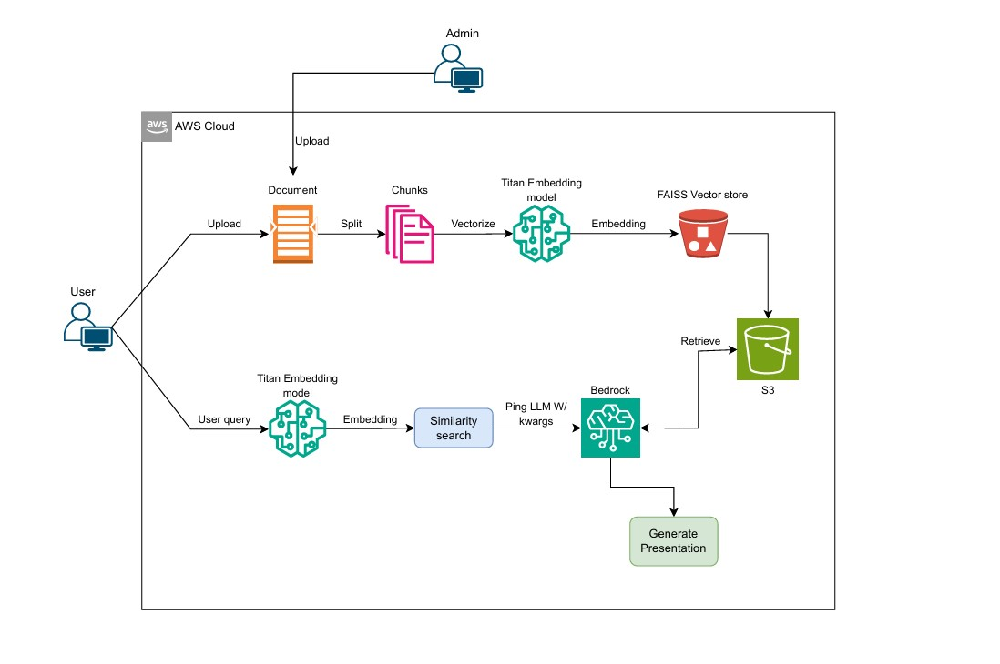

# Presentator - Generative AI Application
## Built Using Amazon Bedrock, Langchain, Python, Docker, Amazon S3
## Models used:
    Amazon Titan Embedding G1 - Text
    anthropic.claude-3.5 sonnet

## Introduction
In the light of my upcoming presentation for the end of my Masters degree, and as the end date of my internship is slowly creeping in. There was an obvious need to build an AI solution that will automate the tedious presentation making once your report is already ready. And what would be more presentable of a GenAI internship other than a GenAI app that ingests the final report, takes queries and direction, and outputs a presentation. The project will use : AWS Amazon Bedrock, docker, python, Langchain, and Streamlit. We will use Retrieval-Augmented generation concept to provide context to the Large Language model along with user query to generates a presentation based on the user's input (style, lenght, format...) and all information povided from our Knowledgebase.

In this hands-on tutorial, we will demonstrate the following:
- Architecture of the applications
- Build 2 applications (ADMIN and USER) and create DOCKER images

## Before getting started
It's always good practice to create your Venv and activate it
Create a .env to store :  AWS_ACCESS_KEY_ID // AWS_SECRET_ACCESS_KEY // BUCKET_NAME // AWS_REGION

## Architecture

  

## USER Application:
  - Build User Web application that you can use seperately from the admin interface, to return the formation.
  - At the application start, in this first iteration to facilitate deployment we download the index files from S3 to build local FAISS index (vector store)
  - Langchain's RetrievalQA, does the following:
     - Convert the User's query to vector embedding using Amazon Titan Embedding Model (Make sure to use the same model that was used for creating the chunk's embedding on the Admin side)
    - Do similarity search to the FAISS index and retrieve 5 relevant documents pertaining to the user query to build the context
    - Using Prompt template, provide the question and context to the Large Language Model. We are using Claude model from Anthropic.
   -  Display the LLM's response as a presentation to the user.

### Docker Commands:

  Build Docker Image:
  
  `docker build -t presentator .`

  Run ADMIN application:
  
  `docker run --env-file .env -p 8084:8084 -it presentator`

## ADMIN Application:
    - Build Admin Web application where AdminUser can upload the pdf.
    - The PDF text is split into chunks
    - Using the Amazon Titan Embedding Model, create the vector representation of the chunks
    - Using FAISS, save the vector index locally
    - Upload the index to Amazon S3 bucket (You can use other vector stores like OpenSearch, Pinecone, PgVector etc., but for this project S3 was an obvious choice)

### Docker Commands:

  Build Docker Image:
  
  `docker build -t presentatoradmin . `

  Run ADMIN application:
  
  `docker run --env-file .env -p 8083:8083 -it presentatoradmin`

### Moving forwrd : 

  Next step would be implementing a React element to the streamlit webapp to showcase the presentation as a standalone element. 
  Adding the text that goes along with each slide
  Implement a Lambda that takes over the task, making the project serverless

